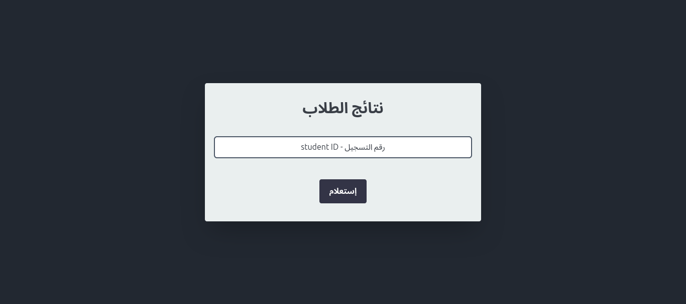
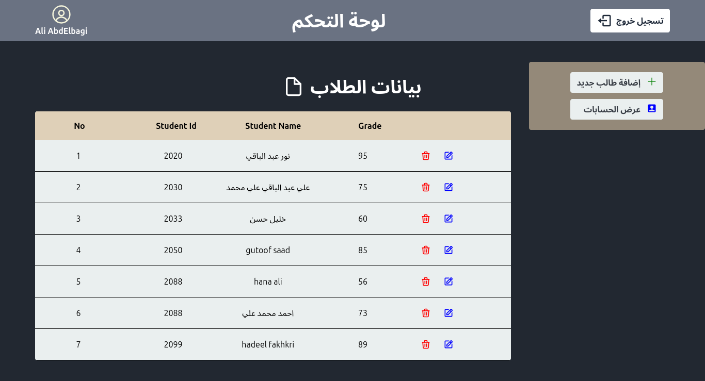

# Students Grade APP

## Built With : 
1. React JS for frontend
2. Tailwind CSS for styling
3. Firebase for DB & Auth

## UIs : 
1. students grade UI

1. Login UI

1. Signup UI

1. Dashboard UI

## Features : 
1. stuednts can see their grade immedietly
2. Teacher can sign up & create account 
3. Teacher can add,edit & delete students data
4. Teacher can apporve or reject any teacher signup 
5. show error popup when user try to login if he has no account , write invalid email , wrong passowrd
6. show toast when teacher add,edit,delete student
7. sort the students data based on student id
   

