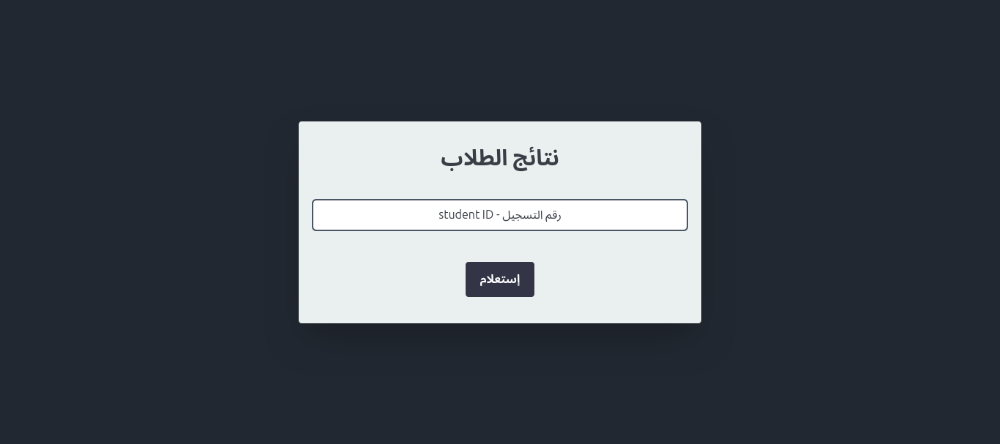
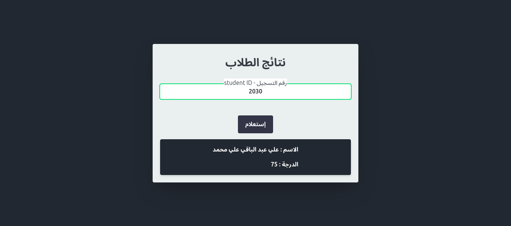
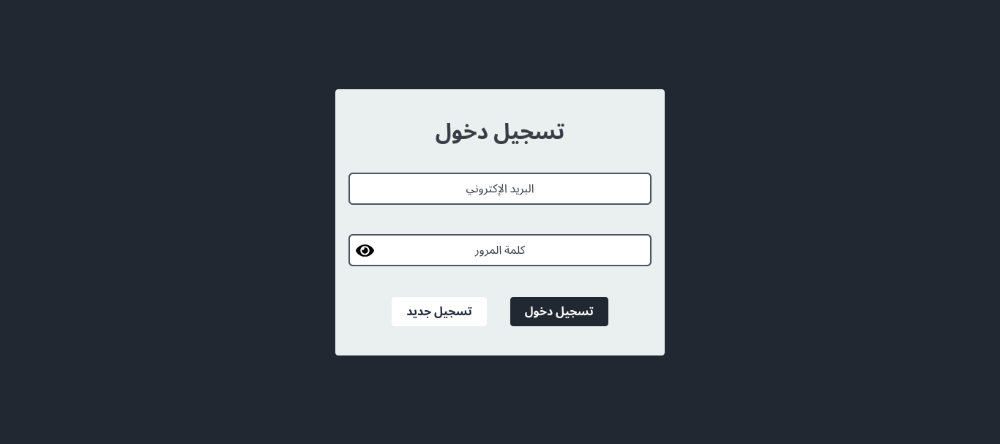
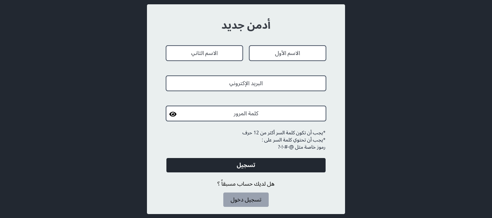
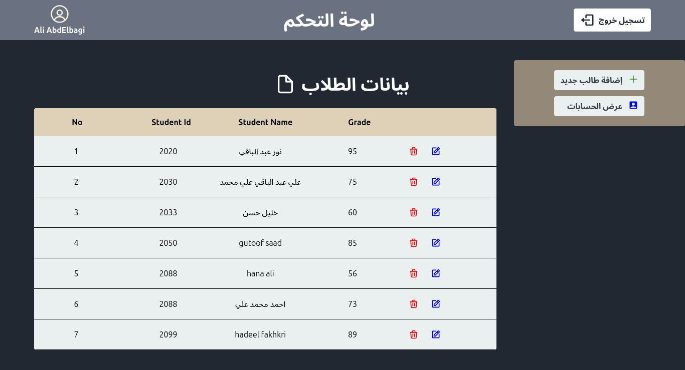

# Students Grade Platform

### This platform is built to let students see their grade & allow teachers to manage students data using dashboard

## Built With : 
1. React JS for frontend
2. Tailwind CSS for styling
3. Firebase for DB & Auth

## UIs : 
1. students grade UI

2. Login UI

3. Signup UI

4. Dashboard UI

## Features : 
1. stuednt can see his grade immedietly by type his id
2. Teacher can sign up & create account 
3. Teacher can add,edit & delete students data
4. Teacher can approve or reject any teacher signup account
5. show error popup when user try to login if he has no account , write invalid email , wrong passowrd
6. show toast when teacher add,edit,delete student
7. sort the students data based on student id
   
## Things i've learn through building platform : 
1. using firebase for create,update,read & delete info
2. using Callback hook 
3. using react lazy loading
4. using sort function to sort data
5. prevent unauth access to dashboard
6. using React Router 

